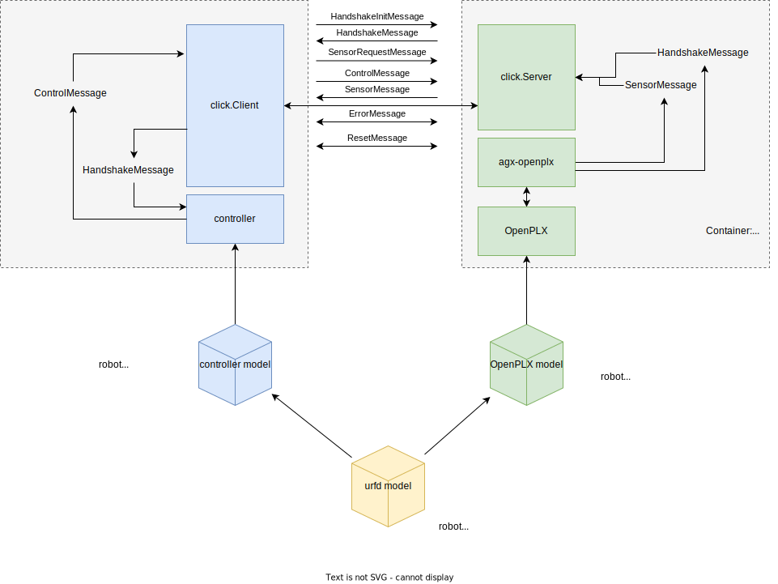

# Click

The main idea behind click is to enable a non-Brick controller talking to a Brick enabled AGX Simulation in way configurable by Brick.
The name comes from the sound two Bricks makes when connected.

There are three main considerations

1. How the controller can send controls and receive sensor values in a similar fashion regardless of environment, ie real or sim.
2. How Brick adds sensors or topology on top of urdf, and how this is communicated to the controller.
3. How to communicate controls and sensors in an effective way.

The current solution is to introduce a Handshake, which enables the simulation to tell the controller what to expect in terms of how to control and what sensor data is being sent.



A typical flow is

1. Client controller connects and sends HandshakeInit
2. Server responds with Handshake
3. Client receives Handshake and validates the setup.
4. Client sends Controls
5. Server responds with Sensors
6. The loop 4-5 is repeated.

## Links

- [C++ ControlMessage example](cpp-src/click/tests/test_control_message.cpp)
- [C++ democlient](cpp-src/democlient/src/democlient.cpp)
- [Python demoserver](python-src/src/server.py)
- [Current protobuf schema](protobuf-src/Messaging.proto)
- [Technology choices etc](doc/messaging.md)

## Running democlient and demoserver

After building as specified below, run these commands in separate prompts:

```bash
python3 -m pyClick.demo.server
```

```bash
build/bin/democlient
```

## Build, test, and install click c++ library

NOTE: -DCMAKE_INSTALL_PREFIX=install makes install in build/install. 

```bash
mkdir build
cd build
cmake -DCMAKE_BUILD_TYPE=Release -DCMAKE_GENERATOR=Ninja -DCMAKE_INSTALL_PREFIX=install ../cpp-src
ninja && ninja test install
```

`ninja click-tests && ninja test` will compile test dependencies and run tests in one step.

## Reset c++ builds

```bash
cd build
rm -rf * .github.conan.cmake
```

## Build and test python

```bash
# Install locally, fetch updates
pip3 install -e python-src
# Run tests
pytest
# Build pip archive
python3 -m build
# Run demo server
python3 -m pyClick.demo.server
```

The generated protobuf python code is committed in git repo.
It is created as part of c++ build, but can be created by running protoc as below.

```bash
protoc -I=protobuf-src --python_out=python-src/src Messaging.proto
```

## Test frameworks

### C++ catch2 framework

We are using [Catch2](https://github.com/catchorg/Catch2/) testing framework with cmake integration

- [catch2 matchers](https://github.com/catchorg/Catch2/blob/devel/docs/matchers.md#top)

### Python pytest

Python tests are using pytest

### Python remarks

To circumvent clashes with python library click, the python library is called pyClick.
